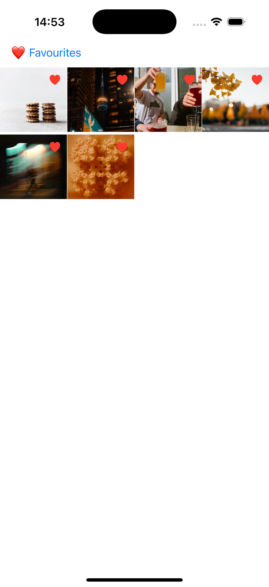

# Gallery App

An iOS application built with UIKit that lets users browse photos from Unsplash, mark them as favorites, and view them in detail. Developed as a practice project to improve skills in iOS development using a clean architecture (MVVM), photo loading, caching, and animations.

---

## Features

- Load photos from the Unsplash API (30 at a time)
- Grid layout with 4x4 photo cells
- Infinite scroll (pagination on scroll)
- Fullscreen photo detail view with title and description
- Swipe left/right to navigate between photos
- Add to favorites with ❤️ and animations
- Filter view to show only favorites
- Pull-to-refresh to reload photos
- Spinner animation on bottom scroll
- Image caching via `SDWebImage`

---

## Technologies Used

- UIKit 
- SDWebImage
- Unsplash API
- UserDefaults
- Swift 5
- Xcode 15+
- Git + GitHub
- `.xcconfig` for safe API key storage

---

## Unit Testing

- `FavoritesManagerTests`
- `GalleryViewModelTests`
- Tests use `XCTest`, `setUp()`, and mock data

To run all tests: `Cmd + U`

---

## 🔐 API Key

The Unsplash API key is stored in `Config.xcconfig` and is excluded from version control via `.gitignore`.

